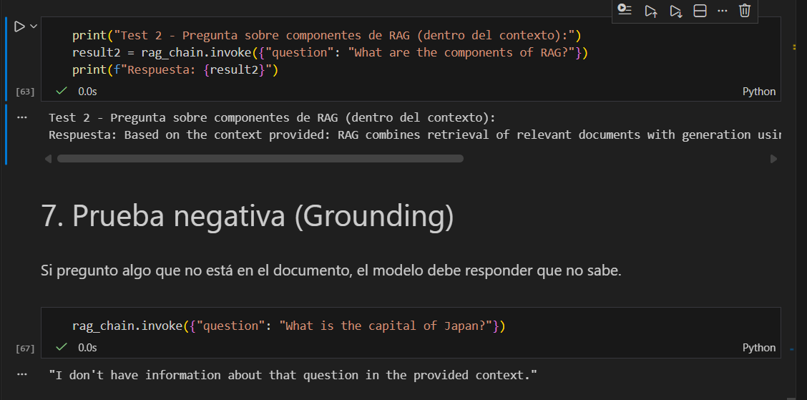

# Project Title
**Repo 2 — RAG with Pinecone + Gemini (LangChain)**

# One Paragraph of project description goes here
This project implements a **Retrieval-Augmented Generation (RAG)** workflow that lets you ask questions over text documents using **Pinecone** as the vector database and **Google Gemini** for both embeddings and chat completions. The notebook loads a `.txt` file, splits it into chunks, generates embeddings with Gemini, upserts vectors to Pinecone, retrieves the most relevant chunks, and finally prompts the LLM to answer **grounded in the retrieved context**.

# Getting Started
These instructions will get you a copy of the project up and running on your local machine for development and testing purposes. See deployment for notes on how to deploy the project on a live system.

## Prerequisites
What things you need to install the software and how to install them

### Software
- Python **3.10+** (recommended)
- Updated `pip`
- VS Code (optional) with the Jupyter extension, or Jupyter Notebook/Lab

### Accounts / Keys
- **Google AI Studio** API key (Gemini): https://aistudio.google.com/
- **Pinecone** account + API key + a created **Index**: https://app.pinecone.io/

### Give examples
- Check Python version:
  ```bash
  python --version
  ```
- Upgrade `pip`:
  ```bash
  python -m pip install --upgrade pip
  ```

## Installing
A step by step series of examples that tell you how to get a development env running

### 1) Say what the step will be
Clone the repository and enter the project folder.

#### Give the example
```bash
git clone <REPO_URL>
cd <REPO_FOLDER>
```

### 2) Say what the step will be
Create and activate a virtual environment (recommended).

#### Give the example
**Windows (PowerShell):**
```powershell
python -m venv .venv
.\.venv\Scripts\Activate.ps1
```

**macOS/Linux:**
```bash
python -m venv .venv
source .venv/bin/activate
```

### 3) Say what the step will be
Install dependencies.

#### Give the example
```bash
pip install -r requirements.txt
```

### 4) Say what the step will be
Create a `.env` file from `.env.example` and fill in environment variables.

#### Give the example
**Windows:**
```powershell
copy .env.example .env
```

**macOS/Linux:**
```bash
cp .env.example .env
```

Then edit `.env` and fill in real values:

```env
GOOGLE_API_KEY=YOUR_GOOGLE_API_KEY
PINECONE_API_KEY=YOUR_PINECONE_API_KEY
PINECONE_INDEX_NAME=rag-gemini
PINECONE_HOST=https://<YOUR_FULL_HOST>.pinecone.io
```

**Where to get each value:**
- `GOOGLE_API_KEY`: Google AI Studio → API keys → Create API key
- `PINECONE_API_KEY`: Pinecone → API Keys
- `PINECONE_INDEX_NAME`: your index name (e.g., `rag-gemini`)
- `PINECONE_HOST`: Pinecone → Indexes → (your index) → Host (copy)

### 5) Say what the step will be
Verify the input data file exists.

#### Give the example
By default, this repo uses:
- `sample.txt` in the **project root**

You can verify it exists with:
```bash
ls
```

### until finished
At this point, you can run the notebook.

### End with an example of getting some data out of the system or using it for a little demo
1. Open the notebook:
   - `RAG_pinecone_gemini.ipynb`
2. Run all cells in order (ideally **Run All**).
3. Suggested demo inside the notebook:
   - Ask: **"What is RAG?"**
   - The notebook should print retrieved chunks and a final grounded answer.

# Running the tests
Explain how to run the automated tests for this system

This project is notebook-centric (end-to-end demo). It does not include an automated test suite (pytest) by default.

## Break down into end to end tests
Explain what these tests test and why

**E2E Test 1 — Ingest + Retrieval + Answer**
- What it tests: the full pipeline works (load → chunk → embed → upsert → retrieve → answer).
- Why it matters: proves the answer is grounded in retrieved context.

### Give an example
In the notebook, run:
- the **upsert** (ingestion) cell
- the **retrieval** cell (print retrieved chunks)
- then ask:
  - `"What is RAG?"`

**E2E Test 2 — Negative grounding test**
- What it tests: the model does not hallucinate when context does not contain the answer.
- Why it matters: validates the “use ONLY context” rule.

### Give an example
In the notebook run:
- `rag_chain.invoke({"question": "What is the capital of Japan?"})`
- Expected: something like **"I don't know."** (or equivalent).

## And coding style tests
Explain what these tests test and why

No linter is configured by default. (Optional) You can use `ruff` or `flake8` if required.

### Give an example
Example with `ruff` (optional):
```bash
pip install ruff
ruff check .
```

# Deployment
Add additional notes about how to deploy this on a live system

This project is designed for **local execution** (academic submission) via notebook. For a real deployment you could:
- Convert the notebook into scripts (`ingest.py`, `qa.py`)
- Expose an API (e.g., FastAPI)
- Run on a server with secure secret management (GitHub Actions Secrets, Vault, etc.)

**Important:** never commit `.env` to the repository.

# Built With
- **Python** — Main language
- **Jupyter Notebook** — Interactive execution
- **LangChain** — RAG orchestration
- **Google Gemini** — Embeddings + LLM
- **Pinecone** — Vector database


# Versioning
We use SemVer for versioning. For the versions available, see the tags on this repository.

This repo can follow **SemVer** (`MAJOR.MINOR.PATCH`) if tags/releases are created.

# Authors
- **Diego** 
(Notebook RAG with Pinecone + Gemini)

# License
This project is licensed under the MIT License - see the LICENSE.md file for details

(If required) add a `LICENSE.md` file with the MIT license text.

# Acknowledgments
- Pinecone documentation
- Google AI Studio / Gemini documentation
- LangChain documentation
